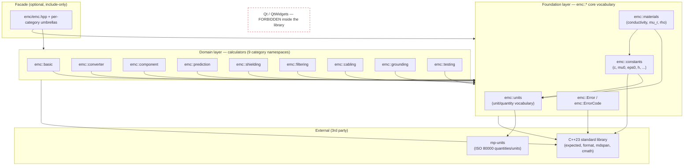

# Architecture & Project Layout

> Purpose: define the layered architecture, directory/namespace layout, dependency rules, public/internal
> boundary, the calculator contract, and the ABI/versioning stance for the Qt-free `emc` library — the
> structural skeleton every other plan document hangs off of.

---

## 0. Reading this document

This is the *structural* document for the `emc` library. It answers **where does code live, what may
depend on what, and what shape does each unit of the library take**. It deliberately stays shallow on
the *contents* of each piece — those are owned by sibling documents:

| If you want…                                  | Read…                                   |
|-----------------------------------------------|-----------------------------------------|
| Why each modern C++ feature is used           | `02-modern-cpp-feature-catalog.md`      |
| The units vocabulary on mp-units              | `03-quantities-and-units-mp-units.md`   |
| Constants & material database internals       | `04-constants-and-material-database.md` |
| `emc::Error` / `std::expected` mechanics       | `05-error-handling-and-validation.md`   |
| The full per-calculator pattern (deep dive)   | `06-calculator-design-pattern.md`       |
| The complete 52-calculator work-list          | `07-calculator-inventory.md`            |
| CMake, the `EMC_API` macro def, install/export | `08-build-system-cmake.md`              |
| Golden-vector / property / constexpr testing  | `09-testing-and-golden-vectors.md`      |
| Migration sequencing & exit criteria          | `10-migration-roadmap.md`               |

This document does not contain buildable source. The fenced blocks are *illustrative* and show the
intended shape of headers, namespaces, and signatures.

---

## 1. Layered architecture

The library is organized into **three layers**. The arrows mean "may depend on" — they point *down*
the stack, and there are exactly two of them. There is **no upward dependency, no sideways dependency
between domain calculators, and absolutely no dependency on Qt anywhere.**

### 1.1 The three layers

**Foundation layer** — the shared vocabulary. Nothing here knows about any specific calculator.

- `emc::units` — the project's unit/quantity vocabulary, built **on top of mp-units** (type aliases,
  named references, dimension shortcuts, parsing helpers used only at boundaries). See doc 03.
- `emc::constants` — one `constexpr` source of truth for physical constants (`c`, `mu_0`, `eps_0`,
  Planck, etc.), expressed as mp-units quantities. Replaces the scattered `#define PI 3.14`,
  `#define SPEEDOFLIGHT 300000000.0`, and the 8+ re-definitions of `qreal mu0 = 4*M_PI*1e-7;`. See doc 04.
- `emc::materials` — one `constexpr` material database (conductivity, relative permeability,
  resistivity, …) with a single representation. Replaces the ~14 inconsistent inline material tables
  (`SkinDepthWidget.cpp`'s if/else strings, `StandardGaugeWireWidget.cpp`'s `enum Material` +
  `GetResistivity()`, etc.). See doc 04.
- `emc::Error` + `emc::ErrorCode` — the single error type returned (inside `std::expected`) by every
  fallible operation. Replaces inline `QMessageBox::warning(...)` (10 files) and the
  `return EXIT_FAILURE;` sentinel in `StandardGaugeWireWidget.cpp::GetResistivity()`. See doc 05.

**Domain layer** — the ~52 calculators, grouped into category namespaces that mirror the app's 9-category
tree. Each calculator is a self-contained `(Input, Result, calculate())` triple (see §5). A calculator
depends *only* on the Foundation layer and the standard library — **never on another calculator's
namespace directly**, and never on Qt. (A handful of calculators legitimately reuse a Foundation-level
helper such as skin depth; that helper is promoted into a shared spot — see §1.4 — rather than letting
`emc::component` reach into `emc::basic`.)

**Facade layer (optional, thin)** — convenience umbrella headers (`include/emc/emc.hpp`,
`include/emc/basic.hpp`, …) that re-include groups of calculators so a downstream consumer can write one
`#include`. The facade contains **no logic** — only `#include` directives and possibly a couple of
`using` re-exports. It exists purely for consumer ergonomics and is allowed to depend on everything below it.

### 1.2 The dependency rule (the one invariant that must never break)

```
Foundation  ->  depends ONLY on: the C++23 standard library + mp-units
Domain      ->  depends ONLY on: Foundation (+ stdlib + mp-units)
Facade      ->  depends on: Domain + Foundation (include-only)
NOTHING in include/emc or src/  ->  depends on Qt, QtWidgets, QString, qreal, QMessageBox, ...
```

Enforcement is mechanical, not aspirational (detailed in docs 08 and 09):

- The `emc` CMake targets do **not** link `Qt::*`. A `find_package(Qt6)` must not appear in the library's
  CMake at all.
- A CI grep gate fails the build if any file under `include/emc/` or `src/` matches
  `Q[A-Z]|qreal|QtWidgets|#include <Q`. (The current app's `HelperTypes.h` starts with
  `#include <QString>` and `#include <QtWidgets>` — exactly what this gate forbids.)
- Domain headers `#include` only Foundation headers; a layering test (a tiny tool or `clang-tidy`
  `misc-include-cleaner` + a custom check) verifies no `src/<categoryA>/...` includes
  `include/emc/<categoryB>/...`.

### 1.3 Dependency graph



ASCII fallback (same information, for environments without Mermaid):

```text
              +------------------------------------------------+
              |  C++23 stdlib            mp-units              |   (external)
              +------------------------------------------------+
                         ^                    ^
                         |                    |
   +------------------------------------------------------------------+
   | FOUNDATION:  emc::units --> mp-units                              |
   |              emc::constants --> emc::units, stdlib                |
   |              emc::materials --> emc::units, emc::constants        |
   |              emc::Error / emc::ErrorCode --> stdlib               |
   +------------------------------------------------------------------+
                         ^
                         | (Domain depends ONLY on Foundation)
   +------------------------------------------------------------------+
   | DOMAIN (calculators, no cross-calculator deps):                  |
   |   basic  converter  component  prediction  shielding             |
   |   filtering  cabling  grounding  testing                         |
   +------------------------------------------------------------------+
                         ^
                         | (include-only)
   +------------------------------------------------------------------+
   | FACADE:  emc/emc.hpp  +  per-category umbrella headers           |
   +------------------------------------------------------------------+

   Qt / QtWidgets  ==>  NOT a node in this graph. Forbidden in include/ and src/.
```

### 1.4 Where do shared physics helpers go?

Several calculators share a sub-computation — the clearest example is **skin depth**, which is both a
top-level `emc::basic` calculator *and* an internal step inside `StandardGaugeWireWidget` (note the
`\delta=\frac{1}{\sqrt{\pi f \mu \sigma}}` comment at the top of that file, then the AC-resistance branch
that reuses it). The rule:

- If a helper is a **public, user-meaningful calculation**, it stays a normal calculator (e.g.
  `emc::basic::skin_depth`) and other calculators call its public `calculate()` — this is *not* a
  forbidden cross-dependency because it goes through the documented public API, exactly like a downstream
  consumer would. We treat `emc::basic` skin depth as a de-facto Foundation primitive in this case.
- If a helper is a **private numeric kernel** with no standalone meaning, it lives in `emc::detail`
  (Foundation-adjacent) and is shared from there, so no domain namespace reaches sideways into another.

This keeps the "no sideways domain dependency" rule intact while still eliminating the copy-paste that
plagues the old code.

---

## 2. Directory & file layout

Target root: `/Users/sufuk/CLionProjects/emcpp`.

The layout follows the conventional **`include/` (public) + `src/` (compiled) split** required by the
locked decision "traditional compiled library". Public headers are installed; `src/` and `src`-local
headers are not.

```text
/Users/sufuk/CLionProjects/emcpp/
├── CMakeLists.txt                      # top-level project(); see doc 08
├── CMakePresets.json                   # configure/build/test presets; see doc 08
├── README.md                           # repo readme (NOT the plan index; that lives in plan/)
├── LICENSE
├── .clang-format / .clang-tidy         # style + the layering/no-Qt lint checks
│
├── cmake/                              # CMake support files (see doc 08)
│   ├── emc-config.cmake.in             # package config template for find_package(emc)
│   ├── emcConfigVersion handling       # generated; semver compatibility
│   ├── CompilerWarnings.cmake          # warnings-as-errors, sanitizers
│   └── Dependencies.cmake              # FetchContent / find_package(mp-units)
│
├── include/                            # PUBLIC headers — installed, this is the API surface
│   └── emc/
│       ├── emc.hpp                      # FACADE: includes everything (convenience)
│       ├── version.hpp                  # EMC_VERSION_MAJOR/MINOR/PATCH (generated; doc 08)
│       ├── export.hpp                   # EMC_API macro (generated by CMake; def in doc 08)
│       │
│       ├── core/                        # FOUNDATION public headers
│       │   ├── error.hpp                # emc::Error, emc::ErrorCode (doc 05)
│       │   ├── units.hpp                # emc::units vocabulary on mp-units (doc 03)
│       │   ├── constants.hpp            # emc::constants (constexpr quantities) (doc 04)
│       │   ├── materials.hpp            # emc::materials database (doc 04)
│       │   └── calculator.hpp           # the Calculator concept + shared traits (doc 06)
│       │
│       ├── basic/                       # DOMAIN: category 1 (Basic Calculations)
│       │   ├── basic.hpp                #   per-category facade umbrella
│       │   ├── antenna.hpp
│       │   ├── decibel.hpp
│       │   └── skin_depth.hpp
│       │
│       ├── converter/                   # DOMAIN: category 2 (Converter)
│       │   ├── converter.hpp
│       │   ├── antenna_factor_gain.hpp
│       │   ├── efield_power_density.hpp
│       │   ├── energy_frequency.hpp
│       │   ├── wavelength_frequency.hpp
│       │   └── vswr.hpp                  # VSWR / RC / RL / ML / TL family
│       │
│       ├── component/                   # DOMAIN: category 3 (Component Calculations)
│       │   ├── component.hpp
│       │   ├── capacitance.hpp
│       │   ├── inductance.hpp
│       │   ├── resistance.hpp           # incl. standard-gauge-wire calc
│       │   ├── microstrip_trace.hpp     # example public header path (see below)
│       │   ├── transmission_line.hpp
│       │   └── harmonic_trap.hpp
│       │
│       ├── prediction/                  # DOMAIN: category 4 (EMC Predictions)
│       │   ├── prediction.hpp
│       │   ├── esd_lightning_coupling.hpp
│       │   └── rf_field.hpp
│       │
│       ├── shielding/                   # DOMAIN: category 5 (Shielding)
│       │   ├── shielding.hpp
│       │   ├── cavity_resonance.hpp     # rectangular enclosure, 12 resonant modes
│       │   └── shielding_effectiveness.hpp
│       │
│       ├── filtering/                   # DOMAIN: category 6 (Filtering)
│       │   ├── filtering.hpp
│       │   └── ferrite.hpp
│       │
│       ├── cabling/                     # DOMAIN: category 7 (Cabling)
│       │   ├── cabling.hpp
│       │   ├── braid_coverage.hpp
│       │   └── crosstalk.hpp
│       │
│       ├── grounding/                   # DOMAIN: category 8 (Grounding)
│       │   ├── grounding.hpp
│       │   └── microstrip_current.hpp
│       │
│       └── testing/                     # DOMAIN: category 9 (Testing)
│           ├── testing.hpp
│           └── noise_figure.hpp
│
├── src/                                # COMPILED implementation (.cpp) + src-local private headers
│   ├── core/
│   │   ├── error.cpp                    # message tables, formatting
│   │   ├── materials.cpp                # out-of-line tables if not fully constexpr
│   │   └── detail/                      # INTERNAL headers (NOT installed)
│   │       └── math_kernels.hpp         # emc::detail shared numeric helpers
│   ├── basic/
│   │   ├── antenna.cpp
│   │   ├── decibel.cpp
│   │   └── skin_depth.cpp
│   ├── converter/
│   │   ├── antenna_factor_gain.cpp
│   │   ├── efield_power_density.cpp
│   │   ├── energy_frequency.cpp
│   │   ├── wavelength_frequency.cpp
│   │   └── vswr.cpp
│   ├── component/
│   │   ├── capacitance.cpp
│   │   ├── inductance.cpp
│   │   ├── resistance.cpp
│   │   ├── microstrip_trace.cpp         # matching impl for the public header above
│   │   ├── transmission_line.cpp
│   │   └── harmonic_trap.cpp
│   ├── prediction/ ...                  # (same per-category shape)
│   ├── shielding/ ...
│   ├── filtering/ ...
│   ├── cabling/ ...
│   ├── grounding/ ...
│   └── testing/ ...
│
├── tests/                              # all tests; the ONLY place I/O (CSV) is allowed (doc 09)
│   ├── CMakeLists.txt
│   ├── unit/                           # per-calculator unit tests
│   ├── golden/                         # reuse the 52 app CSV fixtures as Qt-free vectors
│   │   ├── data/                       #   copied/symlinked from emc-prediction/resources/data/*.csv
│   │   │   ├── SkinDepthWidget.csv
│   │   │   ├── MicrostripTraceWidget.csv
│   │   │   └── ... (52 fixtures)
│   │   └── golden_runner.cpp           # CSV parse -> call calculate() -> compare
│   ├── property/                       # property-based / invariant tests
│   └── constexpr/                      # static_assert compile-time checks
│
├── tools/                             # optional dev tools (CSV (re)blessing, codegen) — NOT in lib
│   └── reblbess_golden.cpp            # re-derive expected outputs after fixing PI=3.14 bugs
│
├── docs/                              # generated/manual API docs (Doxygen, mdBook, etc.)
│
├── plan/                             # THIS PLAN (markdown only)
│   ├── README.md
│   ├── 00-overview-and-goals.md
│   ├── 01-architecture-and-layout.md   # <-- you are here
│   └── ... (02 .. 10)
│
└── third_party/                      # vendored deps ONLY if not using FetchContent
    └── (mp-units pulled via FetchContent by default — see doc 08)
```

### 2.1 Mapping the 9 app categories to folders & namespaces

This is a 1:1 mapping — each app category becomes one `include/emc/<dir>/`, one `src/<dir>/`, and one
`emc::<namespace>`. The source app's directory names are shown so an implementer can trace each move.

| #  | App category (src/ in emc-prediction) | Library folder         | Namespace          | Representative leaves                                  |
|----|---------------------------------------|------------------------|--------------------|-------------------------------------------------------|
| 1  | `BasicCalculations`                   | `…/basic/`             | `emc::basic`       | Antenna, Decibel, SkinDepth                            |
| 2  | `Converter`                           | `…/converter/`         | `emc::converter`   | AF↔Gain, EField↔PowerDensity, Energy↔Freq, λ↔f, VSWR  |
| 3  | `ComponentCalculations`               | `…/component/`         | `emc::component`   | Capacitance, Inductance, Resistance, MicrostripTrace…  |
| 4  | `EMCPredictions`                      | `…/prediction/`        | `emc::prediction`  | ESD/Lightning Coupling, RF Field                       |
| 5  | `Shielding`                           | `…/shielding/`         | `emc::shielding`   | Cavity Resonance, Shielding Effectiveness             |
| 6  | `Filtering`                           | `…/filtering/`         | `emc::filtering`   | Ferrite                                                |
| 7  | `Cabling`                             | `…/cabling/`           | `emc::cabling`     | Braid Optical Coverage, Crosstalk                     |
| 8  | `Grounding`                           | `…/grounding/`         | `emc::grounding`   | Microstrip Line Current Distribution                  |
| 9  | `Testing`                             | `…/testing/`           | `emc::testing`     | Noise Figure                                          |

Note what is **deliberately dropped**: the navigation widgets (`MainWindow.cpp`,
`InductanceWidget.cpp`, etc.) contain no domain logic — they only switch a `QStackedWidget` index — so
they have **no** counterpart in the library. They belong to the app, not the core. (See doc 10.)

### 2.2 Example: one calculator's two files

Public header — `include/emc/component/microstrip_trace.hpp`:

```cpp
// include/emc/component/microstrip_trace.hpp
#pragma once
#include <expected>
#include <emc/core/error.hpp>
#include <emc/core/units.hpp>      // emc::units quantity vocabulary (doc 03)
#include <emc/export.hpp>          // EMC_API (doc 08)

namespace emc::component {

// Which quantity we solve for. Replaces the 4 near-identical methods
// (microstrip/calH/calT/calW) in MicrostripTraceWidget.cpp, each of which had an
// ~8-branch nested if-tree purely to apply mm-vs-mils unit conversions.
enum class MicrostripSolveFor { impedance, height, thickness, width };

struct MicrostripTraceInput {
    emc::units::length              trace_width{};         // W
    emc::units::length              trace_thickness{};     // T
    emc::units::length              substrate_height{};    // H
    double                          relative_permittivity{4.0};
    emc::units::impedance           target_impedance{};    // Z0 (used when solving for a dimension)
    MicrostripSolveFor              solve_for{MicrostripSolveFor::impedance};
};

struct MicrostripTraceResult {
    emc::units::impedance           characteristic_impedance{};
    // plus whichever dimension was solved for, etc.
};

[[nodiscard]] EMC_API
std::expected<MicrostripTraceResult, emc::Error>
calculate(const MicrostripTraceInput& in);

[[nodiscard]] EMC_API
std::expected<void, emc::Error>
validate(const MicrostripTraceInput& in);   // permittivity 1..15, W/H 0.1..3, etc. (was inline QMessageBox)

}  // namespace emc::component
```

Matching implementation — `src/component/microstrip_trace.cpp`:

```cpp
// src/component/microstrip_trace.cpp
#include <emc/component/microstrip_trace.hpp>
#include <emc/core/constants.hpp>
#include "../core/detail/math_kernels.hpp"   // src-local INTERNAL header (not installed)

namespace emc::component {

std::expected<void, emc::Error>
validate(const MicrostripTraceInput& in) { /* range checks -> emc::Error, no dialogs */ }

std::expected<MicrostripTraceResult, emc::Error>
calculate(const MicrostripTraceInput& in) {
    if (auto ok = validate(in); !ok) return std::unexpected(ok.error());
    // single formula path; unit conversion handled by mp-units, NOT by an if-tree
    ...
}

}  // namespace emc::component
```

The two files share the **same relative path** (`component/microstrip_trace`) under `include/emc/` and
`src/` respectively. This 1:1 convention makes navigation trivial and lets CMake glob/list predictably.

---

## 3. Namespace design

All public symbols live under the top-level `emc` namespace. The full table:

| Namespace             | Layer       | Lives in                                | Contents                                                                                 |
|-----------------------|-------------|-----------------------------------------|------------------------------------------------------------------------------------------|
| `emc`                 | top         | everywhere                              | `Error`, `ErrorCode`, facade re-exports, version constants                                |
| `emc::units`          | Foundation  | `include/emc/core/units.hpp`            | project quantity/unit vocabulary on mp-units: `length`, `frequency`, `impedance`, `conductivity`, parse helpers (doc 03) |
| `emc::constants`      | Foundation  | `include/emc/core/constants.hpp`        | `constexpr` physical constants as mp-units quantities: `c`, `mu_0`, `eps_0`, `h`, `eta_0` (doc 04) |
| `emc::materials`      | Foundation  | `include/emc/core/materials.hpp`        | `constexpr` material DB: per-material conductivity, `mu_r`, resistivity; one representation (doc 04) |
| `emc::detail`         | internal    | `src/.../detail/*.hpp` (not installed)  | private numeric kernels, implementation helpers; **not** part of the API contract         |
| `emc::basic`          | Domain      | `include/emc/basic/`                    | category 1 calculators                                                                    |
| `emc::converter`      | Domain      | `include/emc/converter/`                | category 2 calculators                                                                    |
| `emc::component`      | Domain      | `include/emc/component/`                | category 3 calculators                                                                    |
| `emc::prediction`     | Domain      | `include/emc/prediction/`               | category 4 calculators                                                                    |
| `emc::shielding`      | Domain      | `include/emc/shielding/`                | category 5 calculators                                                                    |
| `emc::filtering`      | Domain      | `include/emc/filtering/`                | category 6 calculators                                                                    |
| `emc::cabling`        | Domain      | `include/emc/cabling/`                  | category 7 calculators                                                                    |
| `emc::grounding`      | Domain      | `include/emc/grounding/`                | category 8 calculators                                                                    |
| `emc::testing`        | Domain      | `include/emc/testing/`                  | category 9 calculators                                                                    |

### 3.1 Conventions inside namespaces

- Every calculator exposes a **`calculate`** free function in its category namespace. Two calculators in
  the same namespace each define their own `Input`/`Result` structs (e.g.
  `emc::component::MicrostripTraceInput`, `emc::component::CapacitanceInput`), so the descriptive struct
  names keep `calculate` overloads unambiguous via ADL on the argument type.
- `emc::detail` is the *only* place internal symbols live, and `detail` headers live under `src/` so they
  are physically un-installable. A symbol in `emc::detail` is **never** part of the stable API and may
  change in any patch release.
- `emc::units` is a **vocabulary**, not a units library — it re-uses mp-units and adds project-specific
  named aliases (so call sites read `emc::units::frequency` instead of a raw
  `mp_units::quantity<...>`). The single source for unit semantics remains mp-units (locked decision).

### 3.2 `using namespace` policy

Library headers **never** do `using namespace`. Implementation `.cpp` files may use a file-local
`using namespace mp_units;` (and the relevant `mp_units::si`/`mp_units::isq`) for readability, because
that is confined to a translation unit and cannot leak to consumers.

---

## 4. Public vs internal boundary

### 4.1 The boundary rule

```text
include/emc/**        -> PUBLIC. Installed. Part of the semver contract. Stable.
include/emc/.../detail (if any) -> "soft-internal": installed but documented as unstable.
src/**  (incl. src/.../detail/*.hpp) -> PRIVATE. Never installed. Free to change anytime.
```

Preferred convention: put truly internal headers under **`src/.../detail/`** (e.g.
`src/core/detail/math_kernels.hpp`) so they cannot be installed at all. Reserve an installed
`include/emc/detail/` only for the rare case where a public *inline/template* must reference an internal
helper that therefore has to ship in a header.

### 4.2 When to use PImpl

The calculator pattern is **free functions over POD-ish aggregate structs** (§5). There is *no class
with a vtable or hidden state* in the normal case, so the classic motivation for PImpl (hide members,
stabilize ABI of a class) mostly does not apply. Use PImpl only in these narrow situations:

- A calculator must hold **expensive precomputed state** across many calls (e.g. a cached factorization
  or interpolation table). Then wrap it in a small class with a `std::unique_ptr<Impl>` so the heavy
  members (and any mp-units template instantiations they imply) stay out of the public header.
- You need to keep a **large mp-units template type out of the ABI surface**. Because mp-units quantity
  types are heavily templated, exposing them in a class's data members bloats compile times and freezes
  template details into the ABI. PImpl (or simply keeping the computation in the `.cpp`) avoids that.

For the overwhelming majority of the 52 calculators, **no PImpl is needed** — the aggregate `Input` and
`Result` structs cross the boundary by value, and all the mp-units-heavy math lives in the `.cpp`.

### 4.3 The `EMC_API` export macro

Every public, non-inline, non-template function/class that is part of the API is annotated with
`EMC_API`. It expands to the platform's symbol-visibility / DLL import-export keyword:

```cpp
// include/emc/export.hpp  (this file is GENERATED by CMake's generate_export_header — see doc 08)
#ifndef EMC_API
#  ifdef EMC_STATIC_DEFINE
#    define EMC_API
#  else
#    ifdef emc_EXPORTS          // defined by CMake when BUILDING the shared lib
#      define EMC_API __declspec(dllexport)   /* or [[gnu::visibility("default")]] */
#    else
#      define EMC_API __declspec(dllimport)   /* or empty on ELF/Mach-O */
#    endif
#  endif
#endif
```

> The **authoritative** definition (and the CMake `generate_export_header` invocation that produces it,
> plus `-fvisibility=hidden` defaults) belongs to **doc 08 — Build System**. Here we only fix the
> *convention*: public exported entities are marked `EMC_API`; `inline`/`template`/`constexpr` entities
> that are fully defined in headers are **not** marked (they have no out-of-line symbol to export). The
> aggregate `Input`/`Result` structs are header-only data definitions and need no `EMC_API`; the
> out-of-line `calculate()`/`validate()` functions **do** get `EMC_API`.

---

## 5. The Calculator contract (architectural shape)

At the architectural level, every one of the ~52 calculators is the **same shape** — a triple plus
optional validation, satisfying a shared `Calculator` concept. This replaces the old pattern where each
formula was welded inside a `connect(ui->solveButton, &RichButton::clicked, [this]{ ... })` lambda that
read `ui->spinbox->value()` and wrote `ui->result->setValue(...)` (see `StandardGaugeWireWidget.cpp`).

```cpp
// The canonical shape (per calculator). Full deep-dive: doc 06.
namespace emc::basic {

struct SkinDepthInput {
    emc::units::frequency           frequency{};
    emc::materials::Material        material{emc::materials::Material::copper};
    // members may carry sensible defaults so call sites use designated initializers:
    //   skin_depth({.frequency = 27 * MHz, .material = Material::nickel});
};

struct SkinDepthResult {
    emc::units::length              depth{};
};

[[nodiscard]] EMC_API
std::expected<void, emc::Error>          validate(const SkinDepthInput&);

[[nodiscard]] EMC_API
std::expected<SkinDepthResult, emc::Error> calculate(const SkinDepthInput&);

}  // namespace emc::basic
```

And the `Calculator` concept (defined once in `include/emc/core/calculator.hpp`) that the
`(Input, Result, calculate)` triple must satisfy:

```cpp
// include/emc/core/calculator.hpp
#pragma once
#include <expected>
#include <concepts>
#include <emc/core/error.hpp>

namespace emc {

template <class Input, class Result>
concept Calculator = requires (const Input& in) {
    // calculate(Input) -> std::expected<Result, emc::Error>  (found via ADL)
    { calculate(in) } -> std::same_as<std::expected<Result, emc::Error>>;
};

}  // namespace emc
```

Why a concept at the architectural level: it lets generic test harnesses, batch drivers, and the golden
runner (doc 09) operate over *any* calculator uniformly, and it gives a compile-time contract so a
half-converted calculator fails to compile rather than silently diverging. The **deep treatment** of the
pattern (designated initializers, member defaults, `validate` composition, the concept's exact form, ADL
nuances) is owned by **doc 06**; this section only fixes the architectural invariant: *every calculator
is `(Input, Result, calculate) [+ validate]` returning `std::expected<…, emc::Error>`, and nothing else.*

---

## 6. Cross-cutting concerns

These properties hold uniformly across the whole library and are part of its architecture, not any one
calculator.

### 6.1 Error type placement

`emc::Error` and `emc::ErrorCode` live in the **Foundation** layer (`include/emc/core/error.hpp`) so
every calculator can return them without creating an upward or sideways dependency. There is exactly
**one** error type for the whole library — no per-category error enums. This directly replaces:

- the inline `QMessageBox::warning(...)` calls scattered across 10 files (UI coupling *and* control-flow
  hidden inside the math), and
- the `return EXIT_FAILURE;` sentinel returned from `StandardGaugeWireWidget.cpp::GetResistivity()`
  (a value-channel hack masquerading as an error).

Mechanics (codes, context payload, formatting via `std::format`) are owned by **doc 05**.

### 6.2 Units vocabulary placement

`emc::units` is Foundation (`include/emc/core/units.hpp`) and is the **only** vocabulary domain code uses
for dimensional quantities. No calculator stores a unit "as a bare double + a remembered factor". This
eliminates the architectural root cause of the old unit chaos: the 541 `addItem(unit, factor)` calls,
the giant if/else string→factor chains (e.g. `StandardGaugeWireWidget.cpp` lines ~43–77 mapping
`"Hz"/"kHz"/"MHz"/"GHz"` and `"km"/"m"/"cm"/"mm"/"mile"/"foot"/"inch"` to numeric factors), and the
repeated magic `*39.37` (m→inch) in `MicrostripTraceWidget.cpp`. With mp-units, conversion is a
compile-checked operation on the type, performed **once, at the app boundary** (§7). Details: doc 03.

### 6.3 Thread-safety stance

Every `calculate()` and `validate()` is a **pure function**: it reads only its `const Input&` argument,
writes only its returned `Result`/`Error`, and touches **no global mutable state**. Consequently:

- All calculators are **reentrant and thread-safe by construction** — any number of threads may call any
  `calculate()` concurrently with no locking.
- Constants and the material database are `constexpr`/immutable, so they are safe to read from any thread.
- There are no singletons, no lazily-initialized global caches in the core, no `static` mutable locals.

This is a hard architectural rule; a calculator that needs caching uses a *caller-owned* object
(see §4.2 PImpl), never a hidden global.

### 6.4 No I/O in the core

The library performs **no I/O**: no file reading, no `std::cout`/`std::print` from inside `calculate()`,
no environment access, no logging side-channels. In particular, **CSV parsing does not live in the core**
— it lives in `tests/` (the golden runner) and optionally `tools/`. The old TEST_MODE harness read
`resources/data/<Widget>.csv` *from inside each widget*; the new design inverts this: the library is a
pure function library, and the **test harness** feeds it the 52 CSV vectors externally (doc 09). This
keeps the core free of filesystem and formatting dependencies and keeps it trivially embeddable.

---

## 7. How the existing Qt app maps onto this architecture

The migrated app becomes a **thin consumer**. Each old widget collapses to a three-step boundary
adapter, with the entire formula body replaced by a single `calculate()` call. (Sequencing, per-widget
order, and "definition of done" live in **doc 10** — this section only shows the *shape* of the mapping.)

Old shape (representative — `StandardGaugeWireWidget.cpp`):

```cpp
// BEFORE: math welded into a UI lambda, units decoded by if/else, dialogs for errors
connect(ui->solveButton, &RichButton::clicked, [this]() {
    qreal f   = ui->frequency_spinbox->value();
    qreal lu  = 0;
    if (ui->lenghtUnit_box->currentText() == "km") lu = 1000;        // unit if-tree
    else if (ui->lenghtUnit_box->currentText() == "m")  lu = 1;
    else if (ui->lenghtUnit_box->currentText() == "mm") lu = 0.001;
    // ... ~7 more branches, repeated for frequency, gauge ...
    qreal m = GetResistivity(static_cast<Material>(ui->material_combobox->currentIndex())); // EXIT_FAILURE sentinel inside
    // ... ~80 lines of formula reading widgets and writing ui->result->setValue(...) ...
});
```

New shape (the same widget, after migration):

```cpp
// AFTER: widget = boundary adapter. Three steps. No domain math here.
connect(ui->solveButton, &RichButton::clicked, [this] {
    // 1) PARSE: turn UI strings/numbers into typed mp-units quantities at the boundary.
    emc::component::ResistanceInput in {
        .frequency = ui->frequency_spinbox->value() * unit_from(ui->frequencyUnitBox),
        .length    = ui->length_spinbox->value()   * unit_from(ui->lenghtUnit_box),
        .material  = material_from(ui->material_combobox),
        .gauge     = gauge_from(ui->gaugeBox),
    };

    // 2) CALL: exactly one pure function. All physics lives in the library.
    const auto result = emc::component::calculate(in);

    // 3) RENDER: present the value or the error. No QMessageBox inside the math.
    if (result) render(*result);
    else        show_error(result.error());   // emc::Error -> formatted message at the UI edge
});
```

Key architectural points of this mapping:

- The **unit decode if-trees move to one tiny boundary helper** (`unit_from(combo)`), implemented once in
  the app, returning an mp-units unit — they no longer appear inside any formula.
- **Validation/error presentation moves to the edge**: `validate()` runs inside `calculate()`, returns
  `emc::Error`, and the *app* decides to show a `QMessageBox`. The library never pops a dialog.
- The navigation-only widgets (`MainWindow`, `InductanceWidget`, …) are untouched by the library — they
  still just switch the `QStackedWidget`. They are not consumers of `emc`.

---

## 8. ABI / versioning note (compiled library)

Because this is a **traditional compiled library** (locked decision), it has an ABI surface that
downstream binaries link against. The versioning stance:

### 8.1 Semantic versioning

- The library version is **semver** (`MAJOR.MINOR.PATCH`), exposed via `include/emc/version.hpp`
  (`EMC_VERSION_MAJOR/MINOR/PATCH`, generated by CMake — doc 08) and surfaced to consumers through the
  CMake package version file so `find_package(emc 1.2)` enforces compatibility.
- **MAJOR**: breaking API/ABI change (changed `calculate` signature, removed/renamed symbol, changed an
  `Input`/`Result` struct layout in an incompatible way).
- **MINOR**: additive (new calculator, new optional struct member appended with a default, new overload).
- **PATCH**: bug fixes that do not change the API/ABI — including **re-blessing golden outputs** after
  fixing precision bugs like `PI=3.14`, since that changes *numbers*, not *signatures*. (Consumers should
  expect numeric outputs to become *more correct* across patches; the regression vectors capture this —
  doc 09.)

### 8.2 The export header is the ABI boundary

`include/emc/export.hpp` (the `EMC_API` macro, §4.3) plus `-fvisibility=hidden` defaults mean the ABI is
*exactly* the set of `EMC_API`-marked symbols. Everything else (`emc::detail`, file-local statics,
inline/template instantiations) is **not** part of the ABI and may change freely. Keeping the export
surface small and explicit is what makes the semver promise enforceable.

### 8.3 Keep heavy mp-units templates inside `.cpp`

mp-units quantity types are deeply templated. Two consequences drive an architectural rule:

1. **ABI fragility** — if a quantity type appears in an exported class's data members or in an exported
   *non-template* function's mangled signature, then a change in mp-units' template details can silently
   break ABI.
2. **Compile-time cost** — instantiating those templates in every consumer TU is expensive.

Mitigation (architectural, enforced by convention):

- The **public** signature of `calculate()` takes/returns the project's `emc::units` aliases (themselves
  mp-units types) — this is unavoidable and desired (compile-checked units). But the *implementation*
  (where the bulk of mp-units arithmetic and intermediate quantity types proliferate) is **out-of-line in
  the `.cpp`**, so the heavy instantiations are compiled **once** in the library, not in every consumer.
- Prefer **free functions over the aggregate structs** (no exported templated members) so the ABI surface
  is a handful of plain `EMC_API` function symbols, not a forest of template specializations.
- Where a class genuinely must hold mp-units-typed state, use **PImpl** (§4.2) to keep those types out of
  the public header and the ABI.

> Forward-looking (C++ modules): a future iteration could ship `emc` as C++ modules to cut the template
> recompilation cost further. The plan targets **headers + `.cpp`** for now (locked decision); modules
> are noted only as a later option (doc 08 expands on this).

---

## Cross-references

- `00-overview-and-goals.md` — vision, scope, non-goals, before/after, glossary, success criteria.
- `02-modern-cpp-feature-catalog.md` — every modern C++ feature → pain point → example → rationale.
- `03-quantities-and-units-mp-units.md` — the `emc::units` vocabulary and mp-units adoption.
- `04-constants-and-material-database.md` — `emc::constants` and `emc::materials` single sources of truth.
- `05-error-handling-and-validation.md` — `emc::Error` / `emc::ErrorCode` and `std::expected`.
- `06-calculator-design-pattern.md` — the full per-calculator pattern + worked conversions.
- `07-calculator-inventory.md` — the complete 52-calculator work-list and library mapping.
- `08-build-system-cmake.md` — CMake compiled lib, the `EMC_API`/`version.hpp` definitions, install/export.
- `09-testing-and-golden-vectors.md` — reusing the 52 CSVs as Qt-free regression vectors.
- `10-migration-roadmap.md` — phased sequencing, per-widget migration order, exit criteria.
